# System Design — AI Code Reviewer

**Status:** Draft for team review  
**Version:** 1.0  
**Scope:** v1  
**Providers:** GitHub and GitLab

## 1. Purpose and Scope

AI Code Reviewer analyzes changes in GitHub Pull Requests and GitLab Merge Requests, finds potential issues according to configured rules, validates findings, and publishes the result as a single PR/MR summary comment.

### v1 principles

- VCS-agnostic review core; GitHub/GitLab specifics are isolated in adapters.
- Every review uses an immutable repository snapshot identified by SHA values.
- Reviews run asynchronously through Redis-backed (RQ) workers.
- LLM has no direct VCS access or credentials.
- LLM output is untrusted until validated.
- PostgreSQL is the source of truth; VCS comments are a projection.
- Logical components do not imply separate microservices in v1.

### Out of scope

Automatic code modification, code execution, merge/push/commit/branch operations, merge blocking, inline comments, repository-wide symbol indexing, and deep dependency-graph analysis.

## 2. High-Level Architecture

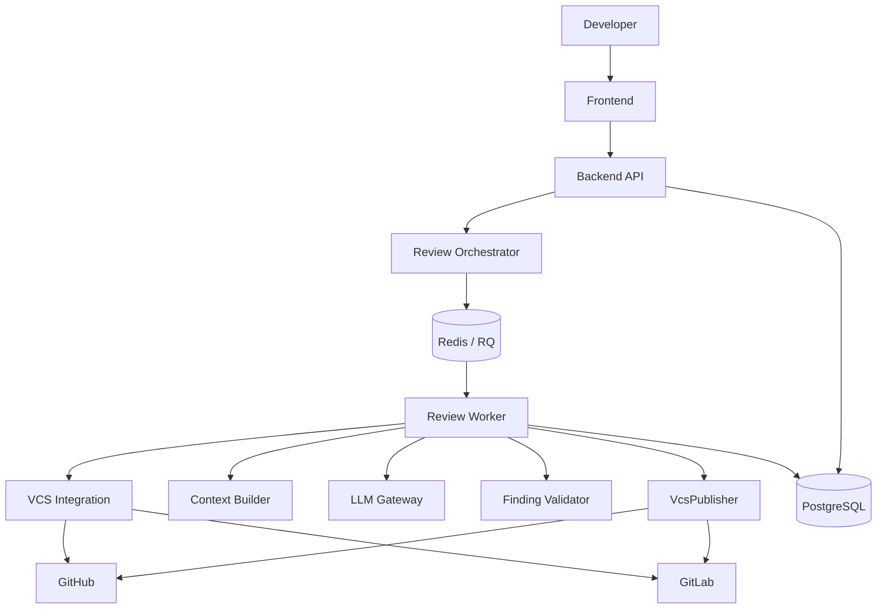

### C4 Context

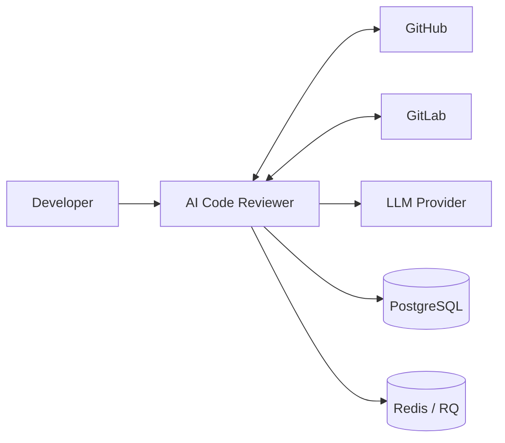

### C4 Container

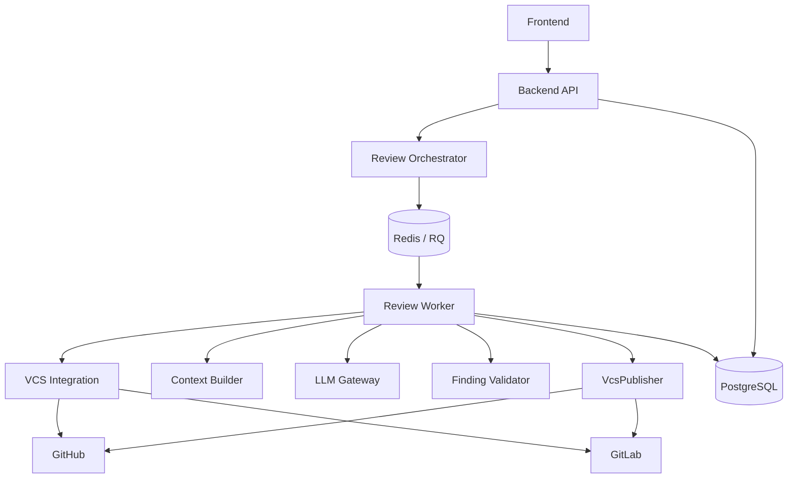

The containers above are logical boundaries. In v1 Backend API/Orchestrator and Worker subcomponents may be deployed as one or several applications according to implementation needs.

## 3. ReviewRun and Immutable Snapshot

Each execution creates a unique `ReviewRun`. It stores the exact state and configuration used for analysis:

```text
run_id
provider
repository_id
change_request_id
trigger_type
base_sha
head_sha
merge_base_sha
rules_version
model_version
prompt_version
status
created_at / started_at / completed_at
```

`base_sha`, `head_sha`, `merge_base_sha`, and `rules_version` are immutable for a run. All VCS reads are SHA-scoped; the worker must not silently switch to the current PR/MR state during execution.

Example: a PR moves from SHA A to SHA B. A running review for A remains a valid review of A; B gets a separate `ReviewRun`.

Statuses:
`NEW → QUEUED → RUNNING → COMPLETED | FAILED | CANCELLED`.

A manual rerun always creates a new `run_id`, even if the SHA is unchanged.

## 4. VCS Integration

Core logic uses a provider-independent interface:

```ts
interface VcsReader {
  getRepository(...)
  getChangeRequest(...)
  getDiff(...)
  getFile(...)
  getMergeBase(...)
}

interface VcsPublisher {
  publishReviewSummary(...)
}
```

Implementations are `GitHubAdapter` / `GitLabAdapter` and `GitHubPublisher` / `GitLabPublisher`.

Provider payloads are normalized into domain models such as `Repository`, `ChangeRequest`, `Diff`, `ChangedFile`, `DiffHunk`, and `FileContent`. Review logic never depends on raw provider payloads.

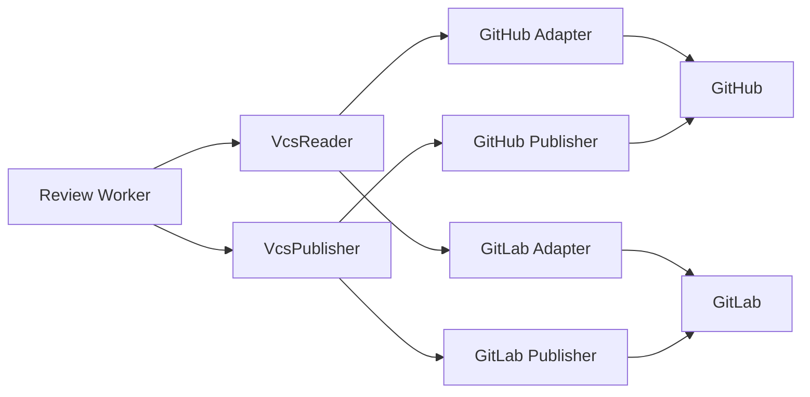

The exact GitHub/GitLab API operations and permission scopes are implementation/security decisions, not part of the core domain interface.

## 5. Webhooks and Triggers

Webhook processing:

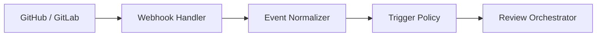

Responsibilities:
- **Webhook Handler:** HTTP endpoint, provider detection, signature validation.
- **Event Normalizer:** provider payload → common `NormalizedEvent`.
- **Trigger Policy:** decides whether the event starts a review.
- **Orchestrator:** resolves the current PR/MR snapshot, creates `ReviewRun`, and queues it.

Initial automatic triggers are proposed as:
- GitHub: PR opened, synchronized, reopened.
- GitLab: MR created, updated, reopened.

Exact provider event/action mapping remains an implementation decision and must be isolated in adapters.

### Deduplication

Webhook `delivery_id` prevents duplicate processing of the same technical delivery, but it is not sufficient as business deduplication.

The automatic review identity is based on:

```text
provider + repository_id + change_request_id + head_sha + automatic_trigger
```

Persist this as a unique `review_deduplication_key` and enforce uniqueness in PostgreSQL. The database constraint, rather than `SELECT then INSERT`, prevents races.

A webhook is a trigger, not the source of truth: the orchestrator obtains the PR/MR state through `VcsReader` before creating the immutable run.

## 6. Queue and Worker

**Redis with [RQ](https://python-rq.org/) is the v1 queue** (changed from RabbitMQ on 2026-10-06 by team decision: the sprint tasks specify Redis, and one Redis container is simpler to operate than a broker). The same Redis may later back a cache/locking/rate-limiting layer behind abstractions.

Queue message contains only the command needed to start processing, preferably:

```json
{"run_id":"..."}
```

The database remains the source of truth for review state; large diffs/context are not sent through the queue.

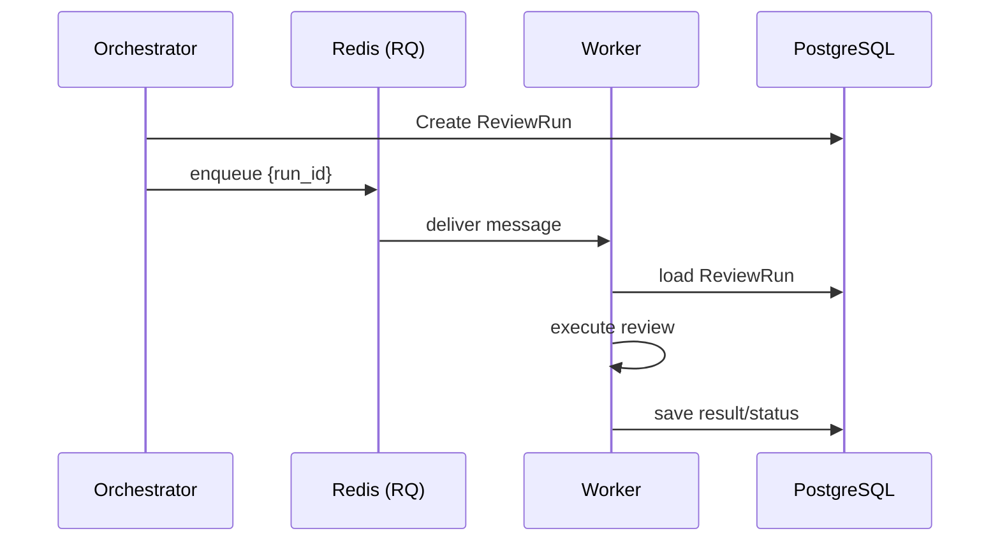

Workers must tolerate duplicate delivery. Retry policy is limited to transient failures with backoff; fatal failures are not retried. Exhausted jobs stay in RQ's `FailedJobRegistry`, which serves as the DLQ; retries use `rq.Retry(max=..., interval=[...])`. Exact retry count/backoff and stale-`RUNNING` recovery policy are open team decisions.

## 7. Context Builder

The Context Builder prepares a bounded `ContextPackage` for the LLM. It uses only `VcsReader` and the immutable run snapshot.

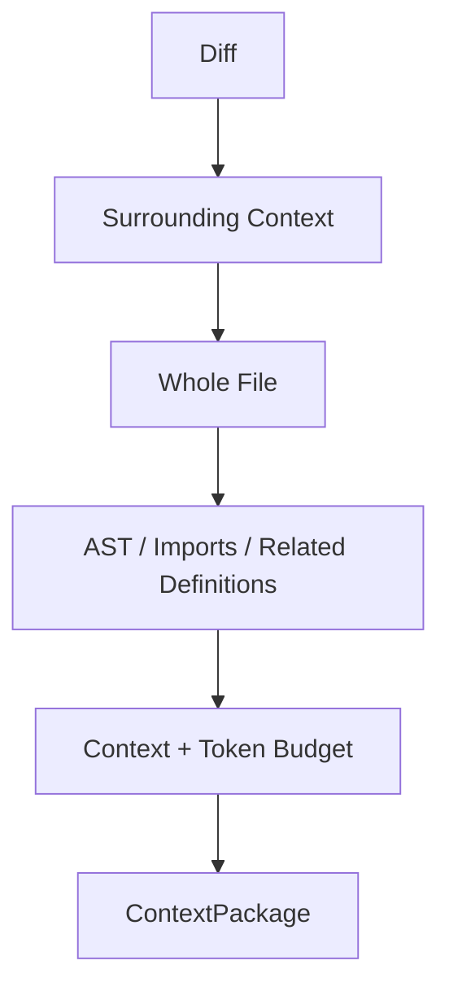

Four levels:

1. **Diff** — changed hunks and metadata.
2. **Surrounding** — nearby lines around relevant changes.
3. **Whole File** — complete changed file when local context is insufficient.
4. **AST / Imports** — symbols, definitions, imports, and relevant related files.

Escalation is deterministic/configurable. The builder stops when sufficient context is obtained or the configured budget is reached. Exact numerical context/token budgets are open.

### Structural analysis

Tree-sitter (or a compatible parser abstraction) is used at Level 4 to extract syntax trees, symbols, imports, definitions, and source ranges. A separate Symbol/Import Resolver finds relevant local definitions on demand.

v1 does not require a repository-wide symbol index. Resolution is limited to relevant dependencies and should not fail the review when an external or unsupported symbol cannot be resolved.

### Cache

`ContextCache` is an abstraction. Cache keys must include repository identity, file path, SHA, and context parameters so data from different snapshots cannot mix. A concrete Redis implementation is not required in v1.

## 8. LLM Gateway

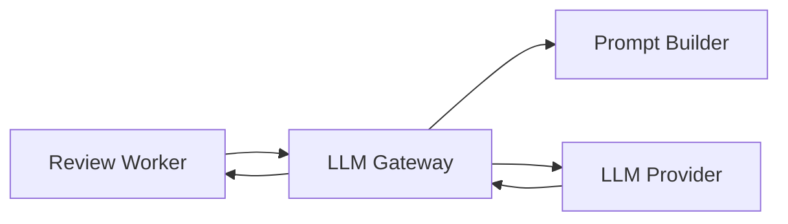

The Worker sends `ContextPackage`, enabled rules, and required review metadata. The Gateway owns provider-specific details, prompt assembly, model selection, timeout/retry handling, and structured response parsing.

The LLM cannot access VCS directly. Source code is treated as untrusted input and is separated from trusted review instructions to reduce prompt-injection risk.

The provider/model is not fixed by this design. `model_version`, `prompt_version`, and `rules_version` are recorded for reproducibility. Exact model, provider, timeout, token limits, and raw prompt/response retention are open decisions.

## 9. Rules and Finding Validation

Rules are immutable, versioned entities. A `RuleSet` represents the exact rules used by a run. `ReviewRun.rules_version` identifies that snapshot.

```text
Rule
  rule_id / version / title / description / category / severity / instructions / enabled

RuleSet
  id / version / created_at
```

Rules are project-scoped and managed through the backend/main database in v1. Every finding references `rule_id`.

LLM findings are candidates:

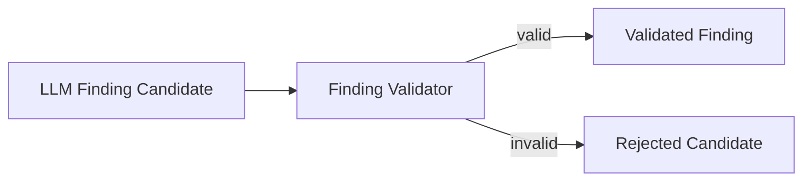

Validator checks at least:
- required fields and valid `rule_id`;
- file/line location and snapshot consistency;
- evidence and actionable recommendation;
- relation to changed code where applicable;
- duplicate findings.

Validation is structural/consistency validation, not a second semantic review. Invalid findings are excluded from publication; retaining rejected candidates for quality metrics is recommended.

## 10. Findings, Matching and History

A finding contains:

```text
finding_id
run_id
rule_id
severity
title / description
file / line
related_changed_lines
evidence
recommendation
confidence
lifecycle_status
```

Lifecycle: `NEW / PERSISTING / FIXED`.

Findings from different successful runs are linked by `FindingMatcher` using rule, file, location and code/evidence similarity. Low-confidence matches are rejected rather than guessed.

For a new successful run, the comparison baseline is the latest **successful completed run of the same PR/MR**. Failed runs do not become the baseline.

This allows history to answer both:
- what was found in a specific snapshot;
- which finding persisted or was fixed in a later successful run.

Exact matching weights/thresholds remain open.

## 11. Publication

v1 publishes the result as one PR/MR summary comment.

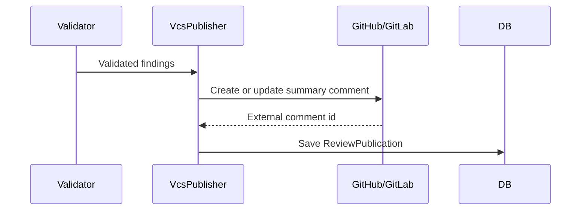

The publisher formats only validated findings. It does not perform analysis or validation.

Use a stable marker such as:

```html
<!-- ai-code-review:summary -->
```

On rerun, the publisher updates the existing marked comment; if it was deleted, it creates a new one. Inline comments are outside v1 but can be added later behind the same publication abstraction.

Publication state is separate from `ReviewRun` state: a review may be `COMPLETED` while publication is `FAILED`.

## 12. Data Model

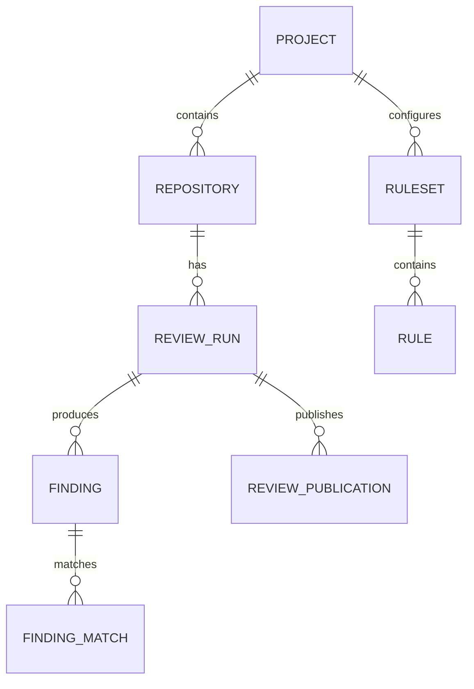

Core tables:

- **Project** — project-level configuration.
- **Repository** — provider, external ID, name, URL, default branch.
- **ReviewRun** — immutable review snapshot, configuration versions, lifecycle.
- **RuleSet / Rule** — versioned review configuration.
- **Finding** — validated finding tied to a run.
- **FindingMatch** — relationship between findings across runs.
- **ReviewPublication** — external PR/MR publication state and comment ID.

Important constraints/indexes:

```text
UNIQUE(review_deduplication_key)
INDEX(repository_id, change_request_id, created_at)
INDEX(repository_id, change_request_id, head_sha)
INDEX(finding.run_id)
INDEX(finding.rule_id)
INDEX(finding_match.previous_finding_id)
INDEX(finding_match.current_finding_id)
```

PostgreSQL is the source of truth. The full diff does not have to be persisted if it can be reconstructed from VCS using the immutable SHAs. Raw prompts and raw LLM responses are optional and require a separate retention/security decision.

## 13. Security and Observability

### Security boundaries

- VCS source, diff, and LLM output are untrusted data.
- LLM receives prepared context only; no VCS credentials or direct API access.
- VCS credentials never appear in queue messages, context packages, or LLM requests.
- v1 has no code execution and no merge/push/commit capability.
- Webhook signatures are validated before event processing.
- Publisher requires only the VCS permissions needed for PR/MR comments.
- Logs must not contain source code, full diff, credentials, webhook secrets, or full prompts by default.

### Observability

`run_id` is the primary business correlation ID. Structured events should cover creation, queueing, start, diff/context retrieval, LLM request, validation, publication, completion, and failure.

Useful metrics include review duration/status, queue wait and depth, LLM latency/errors/tokens, context size and escalation level, finding counts/rejections, matching rate, and publication failures. Tracing is optional for v1.

## 14. Non-Functional Requirements

The architecture must support access isolation, secure secret handling, webhook validation, reliable asynchronous processing, bounded LLM context, observability, and reproducible review runs.

**The numerical values below are deliberately not fixed by this System Design. They require team approval.**

| Parameter | Team decision required |
|---|---|
| PR/MR size | Maximum accepted size |
| Max files | Maximum files per review |
| Max changed lines | Maximum changed lines |
| Context/token budget | Maximum context sent to LLM |
| LLM timeout | Maximum model wait time |
| Retry policy | Attempts and backoff |
| Concurrency | Maximum concurrent reviews |
| p95 latency | Target completion time |
| Retention | Data retention period |
| Availability | Availability target |

The requirements document gives non-binding initial references of **50 text files, 2000 changed lines, 10 concurrent checks, and p95 ≤10 minutes**. These values are not architectural commitments until approved by the team.

## 15. Open Decisions

The following must remain visible for team review rather than being silently fixed by the System Design:

- supported languages and review categories;
- rule catalog, ownership, scoring and inheritance;
- exact GitHub/GitLab webhook event matrix;
- GitHub Cloud vs Enterprise and deployment model;
- VCS permission scopes and secret-management implementation;
- LLM provider/model and data-processing terms;
- LLM timeout/token limits and prompt/response retention;
- context escalation thresholds and token budget;
- finding-match scoring/thresholds;
- RQ retry/backoff, concurrency and stale-run recovery;
- PR/MR size limits and other NFR values;
- storage retention and availability targets.

## 16. Implementation Boundary and DoD

This document defines the architecture and responsibilities, not detailed implementation. It should be sufficient for backend/worker/frontend developers to implement against stable boundaries without requiring a new architectural decision for every component.

### Definition of Done

- `SYSTEM_DESIGN.md` approved by the team.
- C4 Context and Container diagrams reviewed.
- Main review and publication sequence/data flows reviewed.
- GitHub/GitLab abstraction and immutable `ReviewRun` semantics agreed.
- RQ queue semantics and retry policy agreed.
- Context Builder levels and LLM boundary agreed.
- Finding validation and history semantics agreed.
- All numerical NFRs and remaining open decisions explicitly assigned for team decision.
