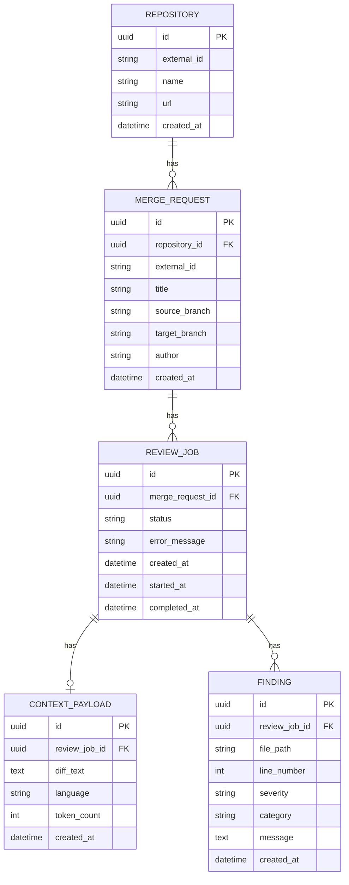

# Entity-Relationship Diagram

```mermaid
erDiagram
    REPOSITORY ||--o{ MERGE_REQUEST : has
    MERGE_REQUEST ||--o{ REVIEW_JOB : has
    REVIEW_JOB ||--o| CONTEXT_PAYLOAD : has
    REVIEW_JOB ||--o{ FINDING : has

    REPOSITORY {
        uuid id PK
        string external_id
        string name
        string url
        datetime created_at
    }
    MERGE_REQUEST {
        uuid id PK
        uuid repository_id FK
        string external_id
        string title
        string source_branch
        string target_branch
        string author
        datetime created_at
    }
    REVIEW_JOB {
        uuid id PK
        uuid merge_request_id FK
        string status
        string error_message
        datetime created_at
        datetime started_at
        datetime completed_at
    }
    CONTEXT_PAYLOAD {
        uuid id PK
        uuid review_job_id FK
        text diff_text
        string language
        int token_count
        datetime created_at
    }
    FINDING {
        uuid id PK
        uuid review_job_id FK
        string file_path
        int line_number
        string severity
        string category
        text message
        datetime created_at
    }
```
